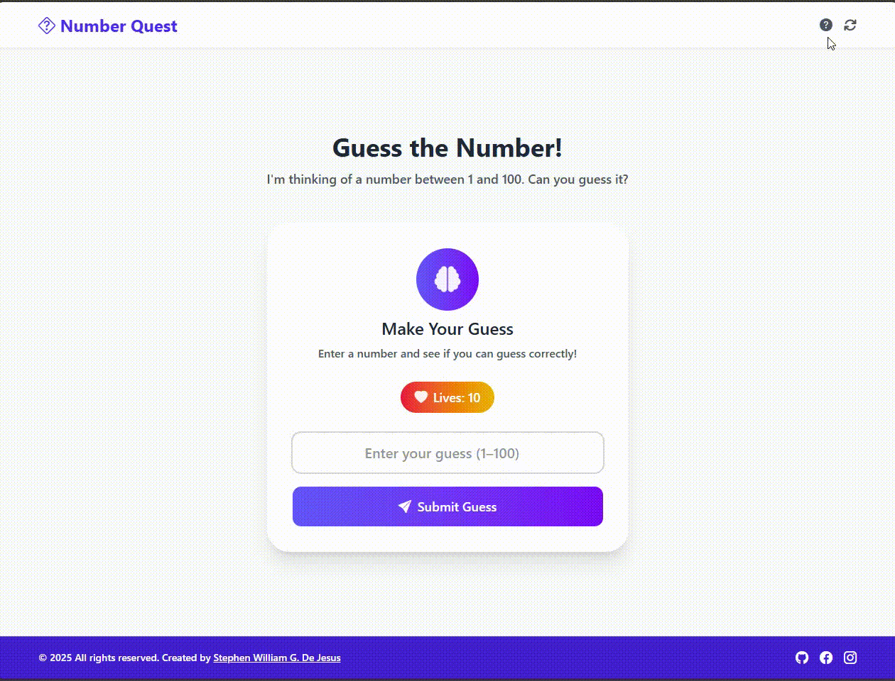
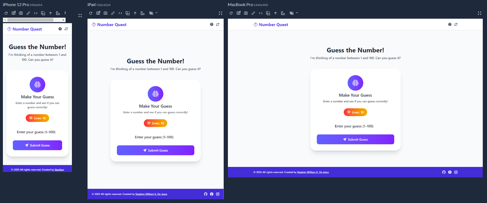

# 🎲 Number Quest – JavaScript Number Guessing Game

A fun and interactive number guessing game built with **HTML**, **Tailwind CSS**, and **JavaScript**.  
Try to guess the secret number between 1 and 100 before you run out of lives!

Crafted by **[Stephen William G. De Jesus](https://www.facebook.com/stephenwilliam.dejesus.5/)**, this project showcases responsive UI, interactive game logic, and accessible components using semantic HTML and utility-first Tailwind CSS.

---

## 📸 Preview  

### 🎞️ Live Interaction (GIF)  

### 🖼️ Full Page Screenshot  

---

## 🌐 Live Demo  
[View Live Demo](https://yourusername.github.io/number-quest/) <!-- Replace with your actual live link -->

---

## 🎮 Features

- 🎯 Random number between 1–100 every game  
- ❤️ 10 lives with animated heart icon  
- 📝 Guess history with hints and icons  
- ❌ Game Over and 🎉 Win modals  
- 🔁 Restart and ❓ Help buttons  
- 💻 Responsive UI with Tailwind CSS  
- ♿ Accessible markup with ARIA roles  
- 🎨 Bootstrap Icons & Font Awesome

---

## 📚 How to Play

1. Enter a number between 1 and 100.
2. Click **Submit Guess** or press **Enter**.
3. The game will give feedback: Higher, Lower, or Correct!
4. You only have 10 tries—make them count!
5. Click **Restart** to play again.

---

## 🛠️ Built With

- [HTML5](https://developer.mozilla.org/en-US/docs/Web/Guide/HTML/HTML5)
- [Tailwind CSS](https://tailwindcss.com/)
- [JavaScript](https://developer.mozilla.org/en-US/docs/Web/JavaScript)
- [Bootstrap Icons](https://icons.getbootstrap.com/)
- [Font Awesome](https://fontawesome.com/)

---

## 🚀 Getting Started

To run this project locally:
1. git clone https://github.com/yourusername/number-quest.git
2. cd number-quest
3. open index.html

## 👨‍💻 Author
Created by [Stephen William G. De Jesus](https://www.facebook.com/stephenwilliam.dejesus.5/)

## 📄 License
This project is licensed under the MIT License.
